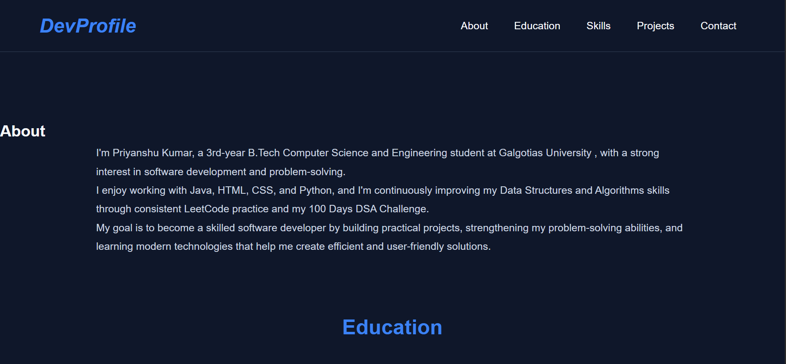
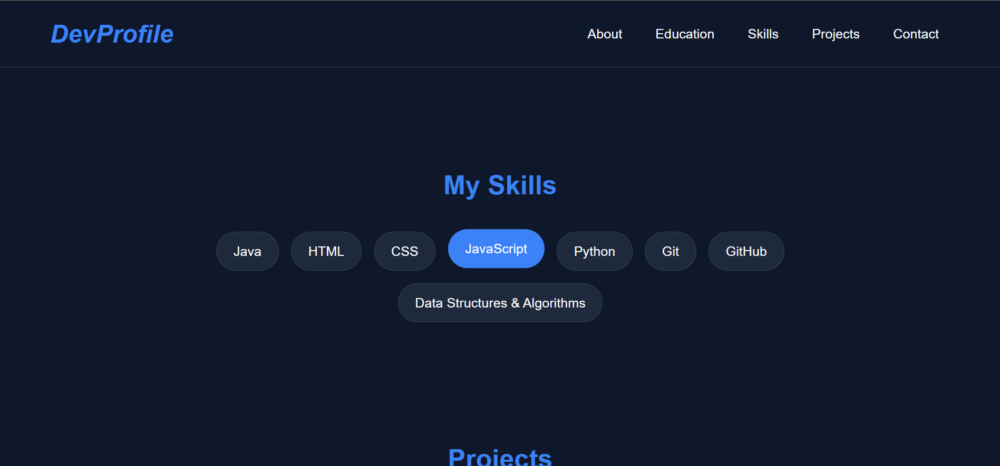
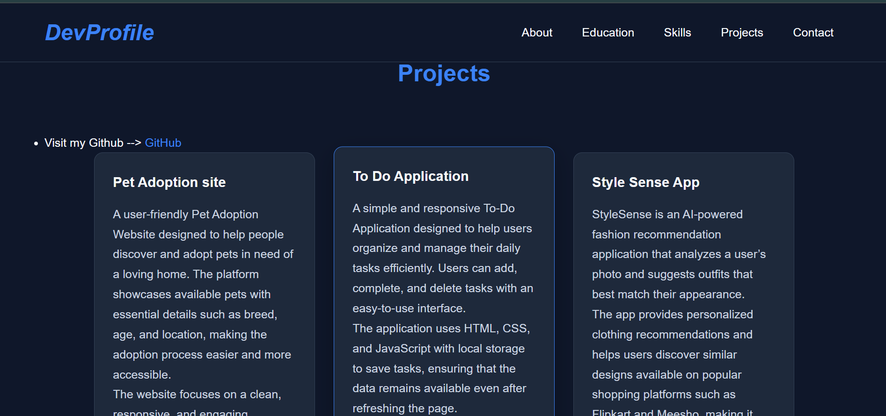

# 🌐 Personal Portfolio

Welcome to my personal portfolio website! This project showcases my skills, learning journey, projects, and contact information as a Computer Science and Engineering student.

## 👨‍💻 About Me

Hi, I'm Priyanshu Kumar, a 3rd-year B.Tech Computer Science and Engineering student at Galgotias University.

I am passionate about software development, web development, and Data Structures & Algorithms. I am continuously improving my programming and problem-solving skills through hands-on projects and my **100 Days DSA Challenge**.

##  Features

*  Clean and responsive homepage
* About Me section
*  Skills section with interactive skill tags
*  Projects section
*  Contact form
*  Responsive design for mobile, tablet, and desktop
*  Modern dark-themed UI
*  Hover and transition effects
*  Fixed navigation bar

## 🛠️ Technologies Used

* **HTML5** – Website structure
* **CSS3** – Styling, layout, responsiveness, and animations
* **JavaScript** – Interactive functionality
* **Git & GitHub** – Version control and project hosting

## 💻 Skills

### Programming

* Java
* Python (Basics)
* Data Structures & Algorithms

### Web Development

* HTML5
* CSS3
* JavaScript

### Tools & Technologies

* Git
* GitHub
* MongoDB (Basics)
* LeetCode

## 📁 Project Structure

Portfolio/
│
├── index.html
├── style.css
|
│
├── images/
│   └── ...
│
└── README.md

## 🎨 Design

The portfolio uses a modern dark navy color palette with blue highlights to provide a clean and professional appearance.

Main colors include:

* Background: `#0F172A`
* Primary: `#3B82F6`
* Secondary: `#60A5FA`
* Text: `#F8FAFC`
* Secondary Text: `#94A3B8`
* Cards: `#1E293B`
* Borders: `#334155`
* Highlight: `#22C55E`

## 📱 Responsive Design

The website is designed to work across different screen sizes:

* 📱 Mobile phones
* 📲 Tablets
* 💻 Laptops
* 🖥️ Desktop screens

## 📸 Screenshots

## 🔗 Live Demo

Live Portfolio: Add your deployed portfolio link here.

## 📂 Repository

GitHub:

## 🎯 Future Improvements

* Add more real-world projects
* Add backend functionality to the contact form
* Add project filtering
* Add downloadable resume
* Add animations and improved UI interactions
* Deploy the portfolio with a custom domain

## My Learning Journey

I am currently working on improving my **DSA and development skills** through consistent practice.

As part of my **100 Days DSA Challenge**, I solve LeetCode problems regularly and share my progress and learnings on LinkedIn.

##  Contact

If you'd like to connect with me or discuss opportunities, feel free to reach out through the contact section of my portfolio.

---

⭐ **If you like this portfolio, consider giving the repository a star!**

**Made with ❤️ by Priyanshu Kumar**
